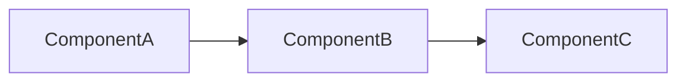
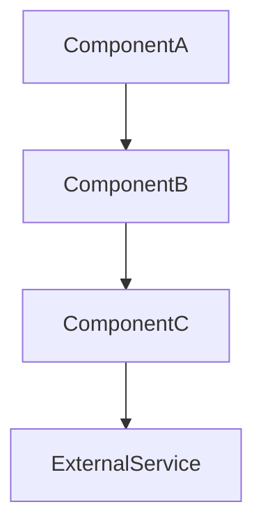
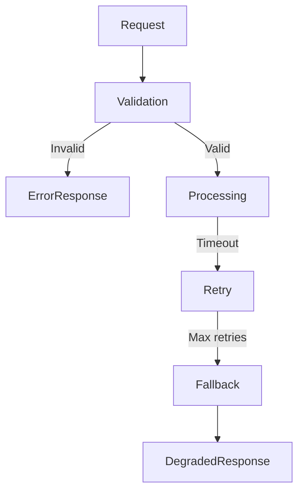
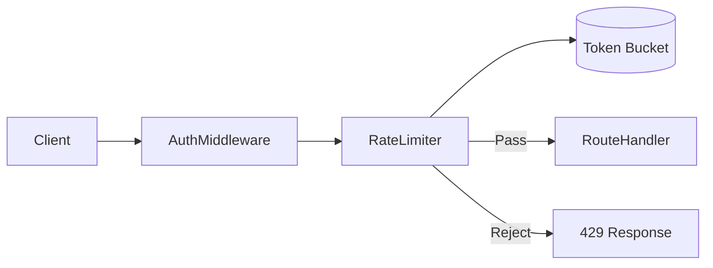
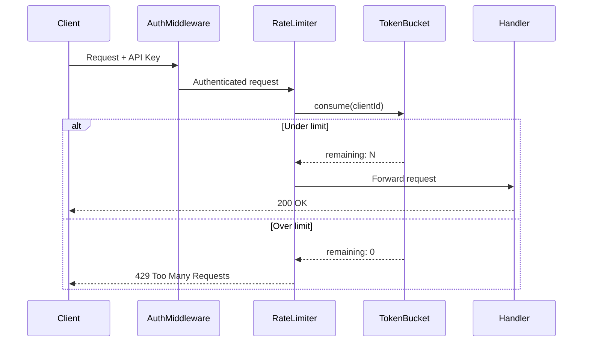

# Subskill: Notion Spec Generator

**Parent:** [SKILL.md](../SKILL.md)  
**Role:** Document generation (Step 3 of parent skill)

---

## Purpose

Generate a structured Notion-ready Markdown document based on selected
documentation level (A/B/C).

---

## Visual Formatting Rules

Every generated document MUST follow these rules to ensure visual scannability:

### Section Headers

Use `##` headings with an emoji prefix for every major section:

| Emoji | Section |
|---|---|
| 📖 | Overview |
| 🔄 | What Changed |
| 🏗 | Architecture |
| 🔀 | Sequence Diagram |
| 🔌 | API Spec |
| ⚖️ | Decisions & Trade-offs |
| ⚠️ | Edge Cases |
| 🔒 | Security Notes |
| 🛠 | Operational Notes |
| 🔮 | Future Improvements |
| 🛡 | Threat Model |
| 💥 | Failure Flow |
| ⏪ | Rollback Plan |
| 📡 | Observability Plan |
| 🧪 | Test Notes |

### Dividers

Insert `---` between every major section for clear visual separation.

### Tables

Use tables (not prose) whenever data has 2+ comparable attributes:

- API endpoints → Method / Path / Request / Response / Status Codes
- Edge cases → Scenario / Impact / Mitigation
- Decisions → Option / Pros / Cons
- Changed files → File / Change / Layer

### Mermaid Diagrams

Minimum diagram count per level:

| Level | Min Diagrams | Required Types |
|---|---|---|
| A | 1 | flowchart |
| B | 2 | flowchart + sequenceDiagram |
| C | 3 | flowchart + sequenceDiagram + failure flow |

Diagrams must reflect actual components from the changed files, never generic placeholders.

### Callouts

Use blockquotes (`>`) to highlight critical warnings, constraints, or assumptions:

> ⚠️ **Note:** This middleware must be applied before auth to prevent...

### Risk Badges

Use emoji badges for risk/status indicators:

| Badge | Meaning |
|---|---|
| 🟢 | Low risk (Level A, score 0–6) |
| 🟡 | Medium risk (Level B, score 7–13) |
| 🔴 | High risk (Level C, score 14+) |

---

## Inputs

- feature_name (required)
- selected_level — A/B/C (required)
- risk_summary from diff-risk-evaluator (required)
- changed_files (required)
- repo_context (optional)

---

## Common Header (All Levels)

Every document must begin with the following structure:

```
# 📋 <Feature Name> — Technical Spec

| Field         | Value                |
| ------------- | -------------------- |
| 📝 Author     | (auto)               |
| 📅 Date       | YYYY-MM-DD           |
| 📊 Level      | A / B / C            |
| 🎯 Risk Score | N (🟢 / 🟡 / 🔴)    |
| 📌 Status     | Draft                |

> **TL;DR:** 2–3 sentence summary of the change.

---

## 📁 Changed Files

| File         | Change                                 | Layer      |
| ------------ | -------------------------------------- | ---------- |
| path/to/file | New / Modified / Deleted — description | Layer name |
```

---

## Level A — Lightweight

Sections (min 1 Mermaid diagram):

```
## 📖 Overview
Brief description of the change and its purpose.

---

## 🔄 What Changed
Bullet list of key changes with context.

---

## 🔀 Simple Flow


---

## ⚖️ Decisions
| Decision | Rationale |
|---|---|
| ... | ... |

---

## 🧪 Test Notes
- [ ] Unit tests added/updated
- [ ] Integration tests covering ...
- [ ] Manual test scenarios: ...
```

---

## Level B — Standard

Sections (min 2 Mermaid diagrams):

```
## 📖 Overview
Description of the change, motivation, and scope.

---

## 🏗 Architecture
Component relationships and data flow.



---

## 🔀 Sequence Diagram
```mermaid
sequenceDiagram
  Actor->>ServiceA: Request
  ServiceA->>ServiceB: Process
  ServiceB-->>ServiceA: Response
  ServiceA-->>Actor: Result
```

---

## 🔌 API Spec
| Method | Path | Request | Response | Status Codes |
|---|---|---|---|---|
| POST | /api/... | `{ ... }` | `{ ... }` | 200, 400, 429 |

---

## ⚖️ Decisions & Trade-offs
| Option | Pros | Cons |
|---|---|---|
| A — ... | ... | ... |
| B — ... | ... | ... |

> **Selected:** Option X because ...

---

## ⚠️ Edge Cases
| Scenario | Impact | Mitigation |
|---|---|---|
| ... | ... | ... |

---

## 🔒 Security Notes
- [ ] Authentication: ...
- [ ] Authorization: ...
- [ ] Input validation: ...
- [ ] Rate limiting: ...

---

## 🛠 Operational Notes
| Item | Detail |
|---|---|
| Dependencies | ... |
| Env Variables | ... |
| Monitoring | ... |
| Alerts | ... |

---

## 🔮 Future Improvements
- ...
- ...
```

---

## Level C — Architecture-Level

Includes all Level B sections plus (min 3 Mermaid diagrams):

```
## 🛡 Threat Model
| Threat | Vector | Likelihood | Impact | Mitigation |
|---|---|---|---|---|
| ... | ... | 🟡 Medium | 🔴 High | ... |

---

## 💥 Failure Flow


---

## ⏪ Rollback Plan
| Step | Action | Verification |
|---|---|---|
| 1 | ... | ... |
| 2 | ... | ... |

> ⚠️ **Data impact:** describe any irreversible data changes.

---

## 📡 Observability Plan
| Signal | Metric / Log | Alert Threshold |
|---|---|---|
| ... | ... | ... |

---

## 📝 ADR
→ invoke [adr-generator.md](adr-generator.md)
```

---

## Guardrails

- Mermaid diagrams must reflect actual components from the changed files, not generic placeholders.
- The metadata table must include the risk score and selected level for traceability.
- Do not add sections beyond the level specification (e.g., no Threat Model in Level A).
- Every section heading must use the designated emoji prefix from the Visual Formatting Rules.
- Use tables instead of prose for any data with 2+ comparable attributes.
- Meet the minimum Mermaid diagram count for the selected level (A: 1, B: 2, C: 3).
- Insert `---` dividers between every major section.

---

## Failure Patterns

- Using the example Mermaid diagrams from this template verbatim instead of building diagrams from the actual code
- Generating a Level B document when Level A was selected (over-documenting)
- Omitting the TL;DR or metadata table from the common header
- Writing vague "Overview" sections that don't reference the actual change
- Generating flat text-only sections without tables or diagrams where structured data exists
- Omitting emoji prefixes from section headings
- Using only one Mermaid diagram when the level requires more
- Missing `---` dividers between sections, producing a wall of text

---

## Example

**Input:**

feature_name: "Add rate limiting to public API"
selected_level: B
risk_summary: Path +6, Layer +3, Magnitude +1, Total 10
changed_files: `middleware/rate-limiter.ts`, `config/rate-limit.ts`, `routes/api.ts`

**Output:**

# 📋 Add rate limiting to public API — Technical Spec

| Field | Value |
|---|---|
| 📝 Author | (auto) |
| 📅 Date | 2025-02-20 |
| 📊 Level | B (Standard) |
| 🎯 Risk Score | 10 🟡 |
| 📌 Status | Draft |

> **TL;DR:** Added token-bucket rate limiting middleware to all public API routes. Configurable via environment variables. Returns 429 when limit exceeded.

---

## 📁 Changed Files

| File | Change | Layer |
|---|---|---|
| middleware/rate-limiter.ts | New — token bucket implementation | Middleware |
| config/rate-limit.ts | New — rate limit configuration | Config |
| routes/api.ts | Modified — apply rate limiter middleware | Routes |

---

## 📖 Overview

Token-bucket rate limiter applied to all `/api/v1/*` routes. Each client is identified by API key (or IP for unauthenticated requests). The bucket refills at a configurable rate and rejects requests with HTTP 429 when depleted.

---

## 🏗 Architecture



---

## 🔀 Sequence Diagram



---

## 🔌 API Spec

| Method | Path | Request | Response | Status Codes |
|---|---|---|---|---|
| ANY | /api/v1/* | — | — | 200, 429 |

Response headers added:

| Header | Value |
|---|---|
| X-RateLimit-Limit | Max requests per window |
| X-RateLimit-Remaining | Remaining tokens |
| X-RateLimit-Reset | Seconds until bucket refill |

---

## ⚖️ Decisions & Trade-offs

| Option | Pros | Cons |
|---|---|---|
| A — Fixed window counter | Simple, low memory | Burst at window boundary |
| B — Token bucket | Smooth rate, burst-tolerant | Slightly more complex |
| C — Sliding window log | Most accurate | High memory per client |

> **Selected:** Option B (Token bucket) — balances accuracy with resource efficiency. Allows short bursts while maintaining a steady average rate.

---

## ⚠️ Edge Cases

| Scenario | Impact | Mitigation |
|---|---|---|
| Distributed deployment (multi-instance) | Each instance has its own bucket → effective limit multiplied | Use shared Redis store for token state |
| Clock skew between instances | Inconsistent refill timing | Use Redis TTL-based expiry instead of local clock |
| API key rotation mid-window | New key gets fresh bucket | Acceptable — does not bypass intent of rate limiting |

---

## 🔒 Security Notes

- [x] Rate limiter applied before route handlers (cannot bypass)
- [x] IP-based fallback for unauthenticated requests (prevents anonymous abuse)
- [ ] Consider stricter limits for sensitive endpoints (login, password reset)
- [ ] Verify rate limit headers do not leak internal architecture info

---

## 🛠 Operational Notes

| Item | Detail |
|---|---|
| Dependencies | Redis (optional, for distributed mode) |
| Env Variables | `RATE_LIMIT_MAX`, `RATE_LIMIT_WINDOW_SEC`, `RATE_LIMIT_STORE` |
| Monitoring | Track `rate_limit.rejected` counter metric |
| Alerts | Alert if rejection rate > 20% sustained for 5 min |

---

## 🔮 Future Improvements

- Per-endpoint configurable limits (e.g., stricter for auth routes)
- Tiered rate limits based on subscription plan
- WebSocket connection rate limiting
