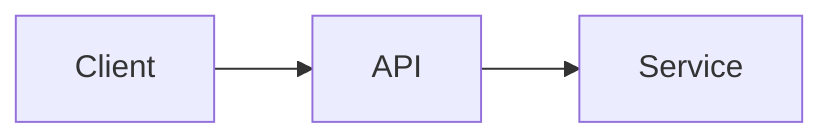
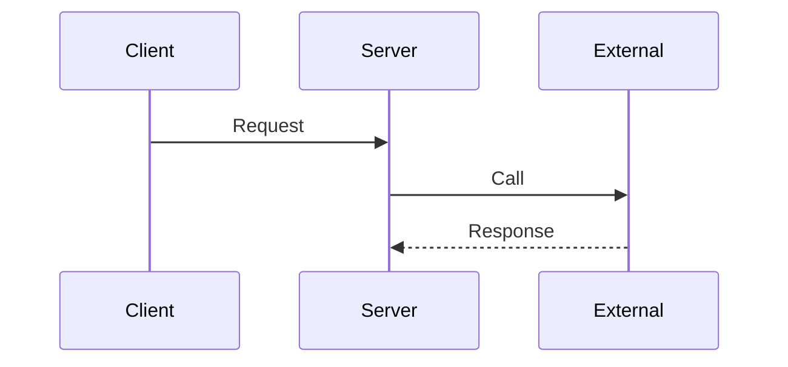
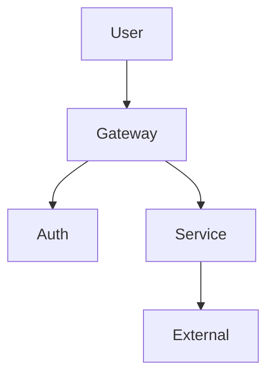
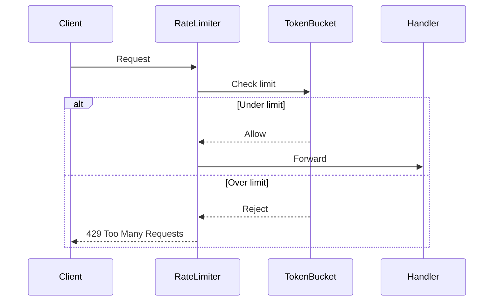

# Subskill: Notion Spec Generator

**Parent:** [architecture-spec.md](../architecture-spec.md)  
**Role:** Document generation (Step 3 of parent skill)

---

## Purpose

Generate a structured Notion-ready Markdown document based on selected
documentation level (A/B/C).

---

## Inputs

- feature_name (required)
- selected_level — A/B/C (required)
- risk_summary from diff-risk-evaluator (required)
- changed_files (required)
- repo_context (optional)

---

## Common Header (All Levels)

Every document must include:

- Title: \<Feature Name\> — Technical Spec
- Metadata table (Author, Date, Level, Risk Score, Status)
- TL;DR (2–3 sentence summary)
- Changed files summary (file list with brief description per file)

---

## Level A — Lightweight

Sections:

1. Overview
2. What Changed
3. Simple Flow (Mermaid)
4. Decisions
5. Test Notes

---

## Level B — Standard

Sections:

1. Overview
2. Architecture
3. Sequence Diagram
4. API Spec
5. Decisions & Trade-offs
6. Edge Cases
7. Security Notes
8. Operational Notes
9. Future Improvements

---

## Level C — Architecture-Level

Includes Level B plus:

- Threat Model
- Failure Flow
- Rollback Plan
- Observability Plan
- ADR-style Decisions (→ invoke [adr-generator.md](adr-generator.md))

---

## Guardrails

- Mermaid diagrams must reflect actual components from the changed files, not generic placeholders.
- The metadata table must include the risk score and selected level for traceability.
- Do not add sections beyond the level specification (e.g., no Threat Model in Level A).

---

## Failure Patterns

- Using the example Mermaid diagrams from this template verbatim instead of building diagrams from the actual code
- Generating a Level B document when Level A was selected (over-documenting)
- Omitting the TL;DR or metadata table from the common header
- Writing vague "Overview" sections that don't reference the actual change

---

## Example

**Input:**

feature_name: "Add rate limiting to public API"
selected_level: B
risk_summary: Path +6, Layer +3, Magnitude +1, Total 10
changed_files: `middleware/rate-limiter.ts`, `config/rate-limit.ts`, `routes/api.ts`

**Output (abbreviated):**

### Add rate limiting to public API — Technical Spec

| Field | Value |
|---|---|
| Author | (auto) |
| Date | 2025-02-20 |
| Level | B (Standard) |
| Risk Score | 10 |
| Status | Draft |

**TL;DR:** Added token-bucket rate limiting middleware to all public API routes. Configurable via environment variables. Returns 429 when limit exceeded.

**Changed Files:**

| File | Change |
|---|---|
| middleware/rate-limiter.ts | New — token bucket implementation |
| config/rate-limit.ts | New — rate limit configuration |
| routes/api.ts | Modified — apply rate limiter middleware |

**1. Overview** — Token-bucket rate limiter applied to all `/api/v1/*` routes...

**2. Architecture** — Middleware chain: auth → rate-limit → handler...

**3. Sequence Diagram:**

*(Sections 4–9 follow the Level B template...)*
